% Fraud Detection   Past, Present, and Future
% Dirk Hesse 
% *Chief Data Scientist at AIA Science*   <small>@NotDirkHesse | dh@aiascience.com</small>

## Fraud!?

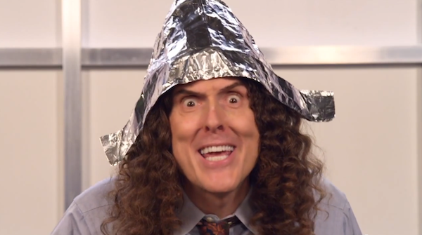

---

# McAfee

> We estimate that the likely 
> annual cost to the global economy 
> from cybercrime is more than $400 
> billion.

[Source](https://www.mcafee.com/us/resources/reports/rp-economic-impact-cybercrime2.pdf)

---

# The Economist

> Total global payment-card fraud losses were $11.3 billion in 2012,
> up nearly 15% from the prior year.

[Source](http://www.economist.com/news/finance-and-economics/21596547-why-america-has-such-high-rate-payment-card-fraud-skimming-top)

---

# Gartner

> The Internet of Things (IoT), which excludes PCs, tablets and
> smartphones, will grow to 26 billion units installed in 2020 [...].

[Source](https://www.gartner.com/newsroom/id/2636073)

---

# Bruce Schneier

- [IoT Teddy Bear Leaked Personal Audio Recordings][s1]
- [Soon You'll Be Able to Hijack Weaponized Police Drones in Connecticut][s2]

[s1]: https://www.schneier.com/blog/archives/2017/03/iot_teddy_bear_.html
[s2]: https://www.schneier.com/blog/archives/2017/04/soon_youll_be_a.html

---

## The future might be a scary place.

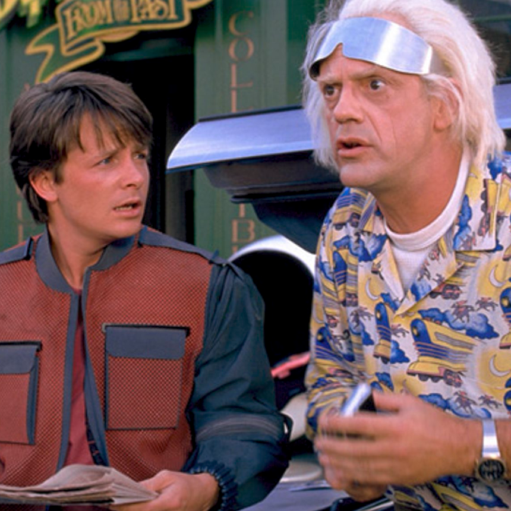

---

# Fraud Detection

<table style="display: inline-block"><tr><td>

<td>

- Historically:
    - Expert systems.
- More recently:
    - Statistical anomaly detection.
    - Network analysis.

</tr></table>

---

## Expert Systems

<table style="display: inline-block"><tr><td>

<td>

- A lot of *if* - *then* rules.
    - If the vibration of an engine increases and the temperature
      sinks, ring an alarm.
    - If a stock price went down by more than a standard deviation in
      a week, short it.
- Used a lot in the past.

</tr></table>

---

## Why rules fail...

- Rigid.
- Hard to maintain.
- Hard to explain.
- Will only find what you're looking for.

---

# Anomaly Detection

- We'll talk about four flavors.
    - Outliers.
    - Cluster analysis.
    - Predictive models.
    - Peer group analysis.
- Literature
    - Practical Machine Learning: A New Look At Anomaly Detection
        - Ted Dunning and Ellen Friedman
    - Peer Group Analysis - Local Anomaly Detection in Longitudinal
      Data
        - Richard Bolton and David Hand

---

### Example: Predicting machine malfunction.

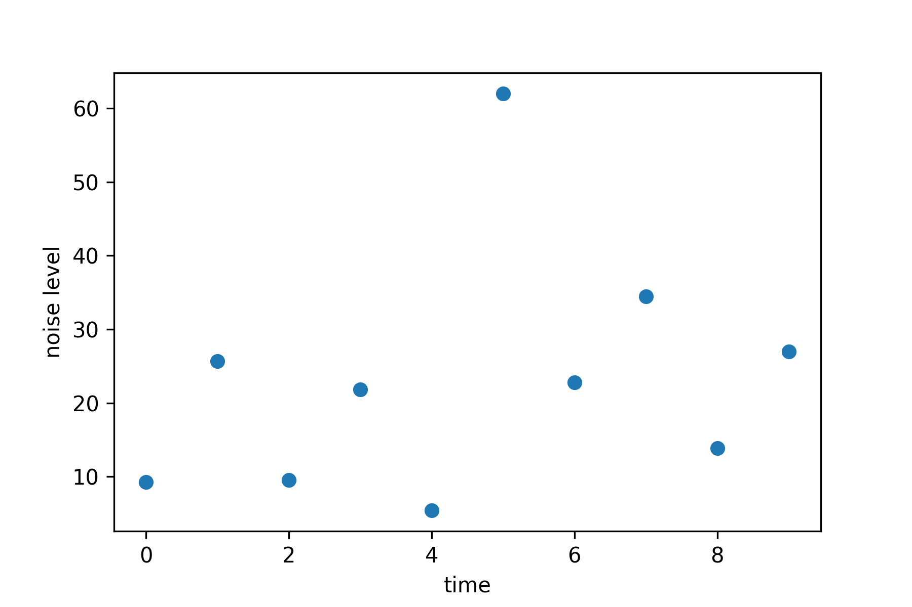

---

## The z Value

- Assume we have data $x_1,\ldots,x_N$.
- Calculate the mean $\overline x = \frac 1 N \sum_i x_i$.
- Calculate the standard deviation $\sigma = \sqrt{\frac{1}{N} \sum_i (x_i - \overline x)^2}$
- Calculate the z-value $z_i = (x_i - \overline x) / \sigma$.
- Flag everything with $z > z_\mbox{max}$ as anomaly.
- Even better: Use *median* and *median absolute deviation* from the median.

---

## The Normal Distribution

---

# Feature Engineering

---

---

## Features are Your Friend

- Take your time finding good features.
- Good features beat a good model every time!
- Explore correlations.
- Talk to experts!

---

## Take your time!

<table>
<tr>
<td>
{style=width:30vw}
<td>
*Give me six hours to chop down a tree and I will spend the first
four sharpening the axe.*
</table>

---

## Feature Engineering

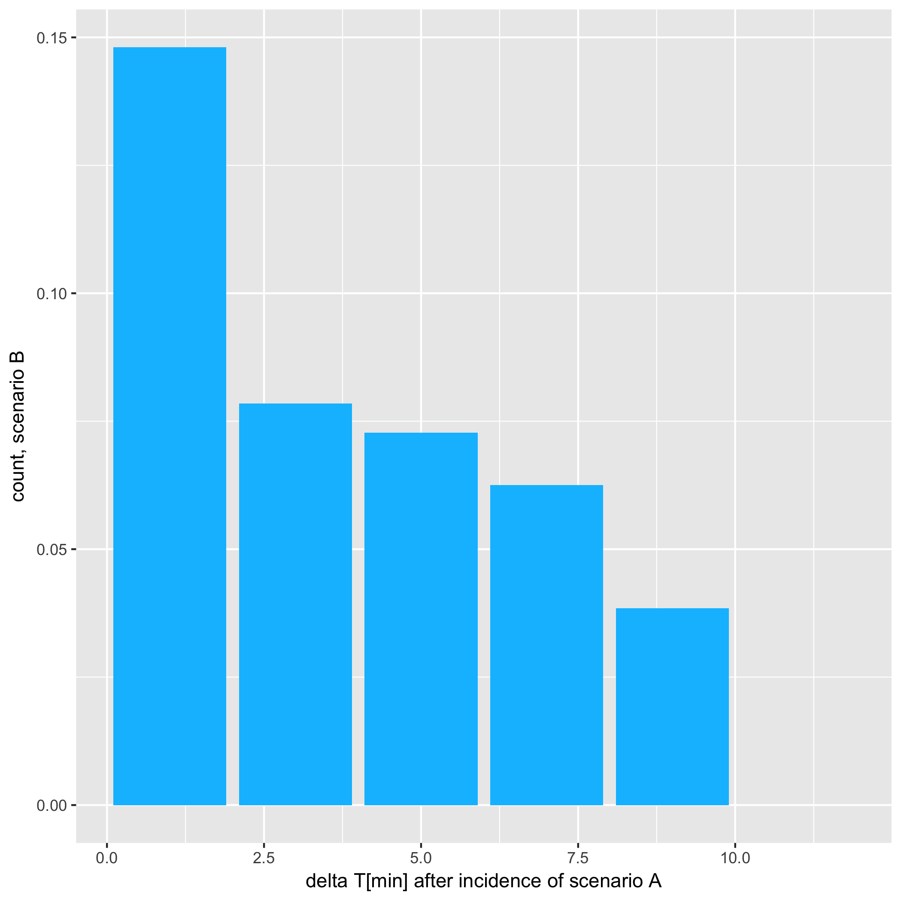

---

## Example Data: BABS

<table>
<tr>
<td>
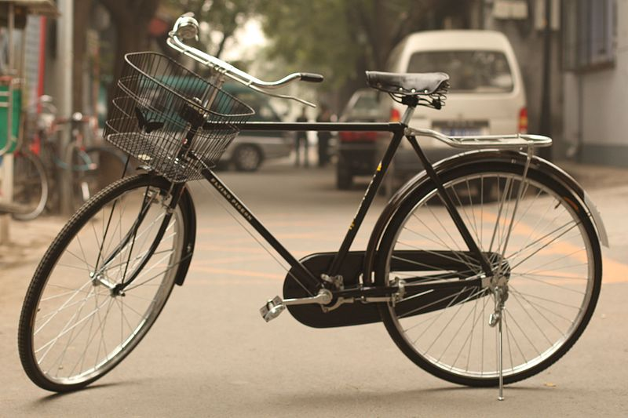{style=width:30vw}
<td>
- Hourly counts of bike trips.
- Collected 2014/2015.
- Publicly available.
</table>

---

## The Need For Clustering

- There might be natural variations in data.
    - Weekend vs. weekday spending patterns.
    - Heart rhythms at rest vs. during sport.
- Enter: Cluster methods.

---

## Clustering 101

- Needed: Some measure for distance between measurements.
    - I.e. a metric.
- Objective: Find $k$ clusters of points that are close together.
    - For some value of 'close'.
    - Some methods find $k$ automatically.
    - Most methods need it as input.
- Now identify points not fitting in.

---

## Not fitting in ...

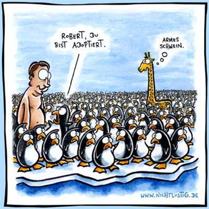

---

## Clustering

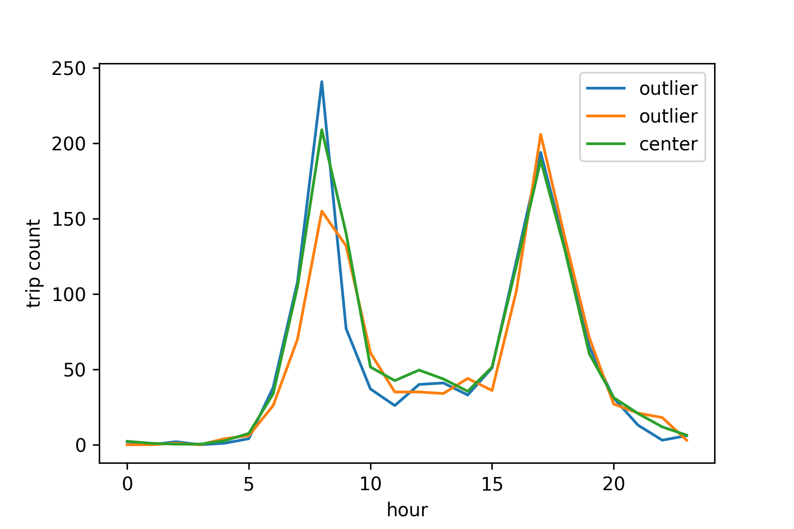

---

## Clustering for fraud detection

- Calculate the per-cluster standard deviation
  $$\sigma_l = \sqrt{\frac 1 {N_l} \sum_{i; C(x_i) = l} \|x_i -
  \mu_l\|^2}.$$
- And the per-cluster $z$-value
  $$z_i = \frac{x_i - \mu_{C(x_i)}}{\sigma_{C(x_i)}}.$$
- Classify points as an **anomaly** if
  $$z_i > z_\mbox{max}.$$

---

## Predictive modeling for fraud detection
## ... in time series data.

---

# Anomalies as prediction error.

- Build a model that predicts $y(t) \approx f(x)$.
- E.g. using autoregressive modeling.
    - $x^{(i)}(t) = y(t - \Delta_i)$.
- Estimate the mean modeling error $\mu = \operatorname{E}[y - f]
  \approx 0$.
- Estimate the variation $\sigma^2 =
  \operatorname{E}[(y - f - \mu)^2]$.
- Calculate a $z$ score.
- Flag anomalies if $z > z_{\mbox{max}}$.

---

## Predicting Time Series

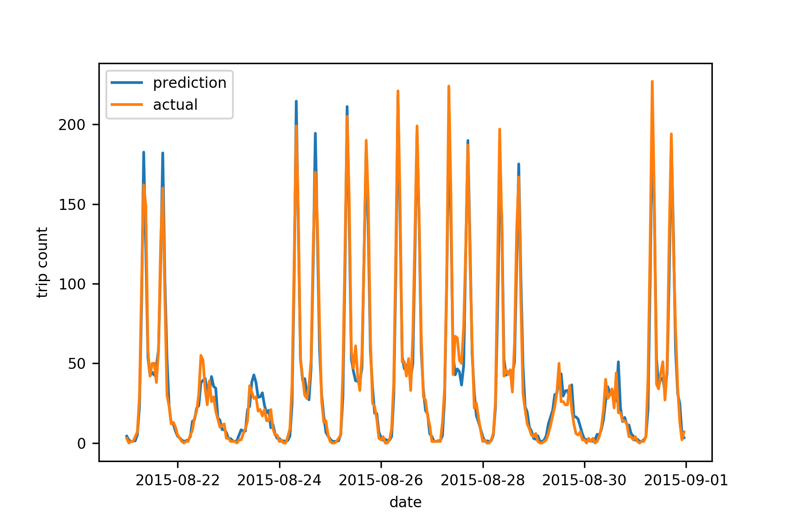

---

## z values

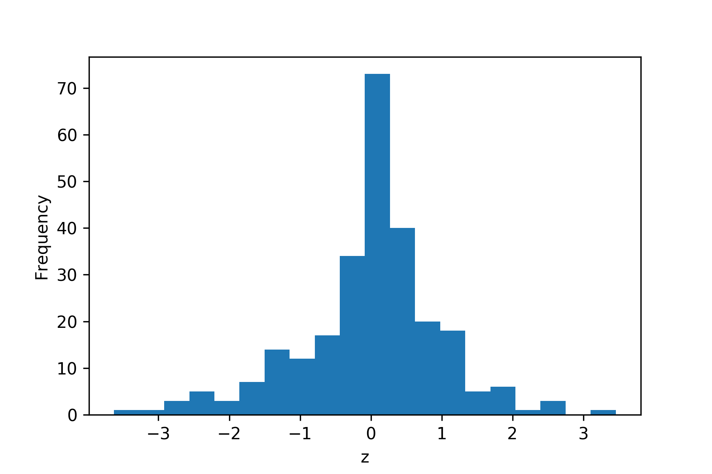

---

# Peer Group Analysis

- Used for e.g. time series data.
- Define train period.
- Find parts of time series with similar behavior.
- Group those together.
- Calculate in-group $z-score$.
- Very similar to $k$-nearest neighbors.

---

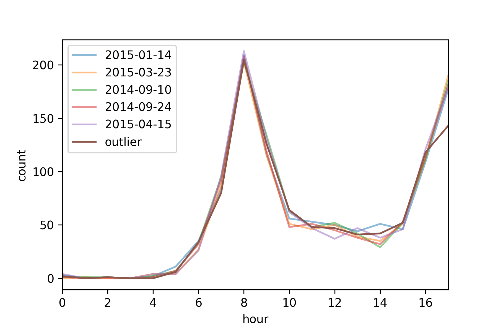

---

# The Future

- Lots of focus on *(social) networks*.
    - Who is friends with whom?
    - Who talks to whom?
- Easy to catch main players e.g. in Enron email data.
- Useful tools: Graph databases (e.g. Neo4j).
- Wide field, out of scope for talk.

---

# Questions?

---

## Finding k

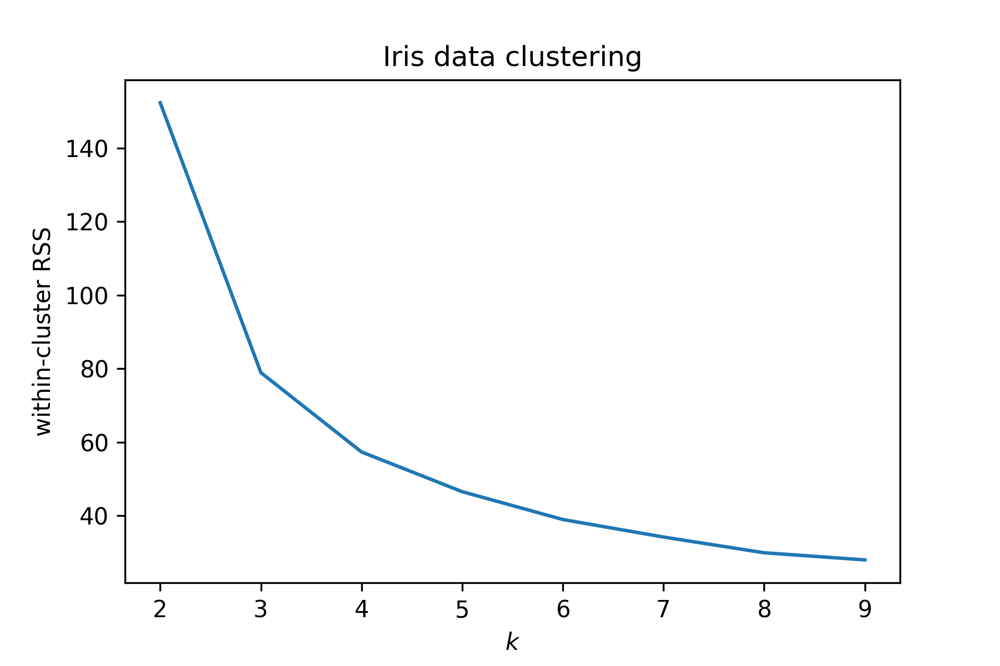

